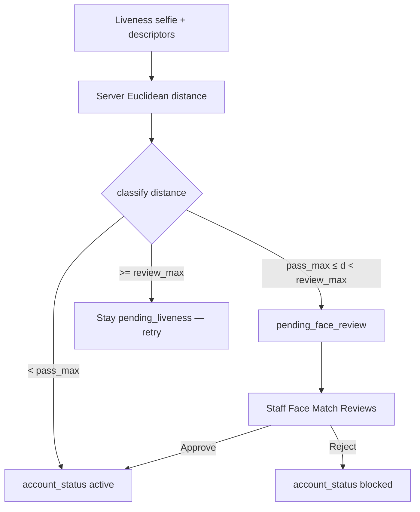

# UNIFAST System — Identity Verification Flow

> **Note:** This is the intended/spec flow for implementation reference. It describes the target identity verification behavior end-to-end and is not necessarily fully implemented yet.

---

## PART 1 — ONBOARDING (happens once when account is first activated)

### Step 1 — Fill KYC form

- Grantee receives invitation email and clicks the activation link
- Grantee fills in the KYC profile form:
  - Full name
  - Student ID number
  - Program / course
  - Year level (optional; collected for display only — not used in masterlist match)
  - Contact number
  - Address
  - Socio-economic details
- System cross-checks submitted name, student ID, and program against the imported CHED masterlist
- If any of those matched fields does not match the masterlist → account blocked, error shown, cannot proceed
- If name, student ID, and program match → proceed to Step 2

### Step 2 — Scan School ID (live camera)

- Camera activates on screen with a card-shaped guide frame
- Grantee holds their physical School ID inside the guide frame
- System runs these checks simultaneously on the live camera frame:
  - **jsQR** reads the QR code on the ID → verifies it matches the TCC registrar domain
  - **OCR.space** extracts the name and student ID printed on the card → cross-checks against the CHED masterlist and the KYC form just submitted → all three must match
  - **face-api.js** detects the face photo on the ID card → crops it → saves it as the reference photo → stored as `id_reference_face.jpg`
  - **Pillow** checks the captured frame for moiré patterns (screen photography) or printed paper texture
- If all checks pass → proceed to Step 3
- If any check fails → error shown, grantee asked to retry

### Step 3 — Onboarding liveness challenge

- Camera switches to front-facing mode pointed at the grantee's live face
- Randomized 3-step challenge appears on screen:
  - Blink
  - Turn head left
  - Turn head right
- Order is randomized each session
- Grantee performs each action when prompted
- After all three steps pass:
  - Short frontal gate: prompt **Look straight at the camera** (face centered in oval, not turned left/right)
  - Only then is the live match selfie captured → saved as `onboarding_selfie.jpg` (avoids capturing a leftover turn pose)
  - **face-api.js** computes descriptor from the live frontal camera feed
  - Euclidean distance vs stored ID reference descriptor (**server recomputes**; client distance is ignored)
  - **Three-tier onboarding zones** (defaults; overridable via env / Policy Settings):

| Zone | Distance rule | Outcome |
| --- | --- | --- |
| Confident | `distance < 0.45` (`IDENTITY_FACE_PASS_MAX`) | Auto-activate account (`active`) |
| Uncertain | `0.45 ≤ distance < 0.60` (`IDENTITY_FACE_REVIEW_MAX`) | Flag for staff review — **do not** auto-block |
| Mismatch | `distance ≥ 0.60` | Reject attempt — student may **retry** liveness (stay `pending_identity` / profile `pending_liveness`; **do not** auto-block) |



  - While challenges run, the client captures **two challenge stills** (frames from the first two successful challenges — typically turn poses when order allows; blink is captured if it is among the first two)
  - Hard mismatch stores the latest selfie + distance for audit, keeps profile `pending_liveness`, leaves user `pending_identity`, and returns a clear validation error so the student can retry on the same screen
  - Uncertain path stores selfie + descriptors + challenge stills, sets profile `pending_face_review` and user `pending_face_review`, and shows the student a waiting screen (not “blocked” language)
  - Staff queue: `/app/face-reviews` — ID reference + onboarding selfie + **2 labeled challenge stills**; approve → activate; reject → block
  - After staff approve **or** reject: challenge still files are **deleted** (review-only evidence). `id_reference_face`, `onboarding_selfie`, and encrypted descriptors are **kept** as vault match anchors
  - Both descriptors discarded from the client after comparison; server retains encrypted descriptors for audit/review and Requirements Slot 1 matching
- Result logged: distance score, zone, liveness confirmed, timestamp, IP address

### Step 4 — Account activated

All four layers confirmed:

- KYC form matches CHED masterlist ✓
- ID card name and student ID match masterlist ✓
- ID QR code verified as legitimate TCC ID ✓
- Live onboarding face matches ID card face ✓ (confident auto-pass **or** staff-approved uncertain review)

Then:

- Account status → **active** (`KYC Verified` / portal access)
- Grantee can now access the portal
- Requirement Vault remains locked until their batch window opens

> **Onboarding vs Requirements Slot 1:** Onboarding liveness uses **three-tier** zones (confident / uncertain→staff review / mismatch). Requirements Slot 1 stays **binary**: distance must be below `IDENTITY_FACE_MATCH_THRESHOLD` (default ~0.5) vs **both** stored ID reference and onboarding selfie descriptors, else hard reject. Slot 1 does not use the onboarding uncertain band.

### Photos stored after onboarding


| Photo             | Filename                     | Purpose                                                                 | Retention |
| ----------------- | ---------------------------- | ----------------------------------------------------------------------- | --------- |
| ID reference face | `id_reference_face.jpg`      | Cropped face from the physical ID card (Slot 1 / vault match anchor)    | Kept after face-review decision |
| Onboarding selfie | `onboarding_selfie.jpg`      | Frontal live selfie after challenges + look-straight gate (match anchor) | Kept after face-review decision |
| Challenge still 1 | `liveness_challenge_1.jpg`   | Review-only frame from first successful challenge                       | Deleted after approve/reject |
| Challenge still 2 | `liveness_challenge_2.jpg`   | Review-only frame from second successful challenge                      | Deleted after approve/reject |

Encrypted descriptors (`id_reference_face_descriptor`, `onboarding_selfie_descriptor`) are kept with the anchors so Requirements Slot 1 matching continues to work after staff decision.

---

## PART 2 — REQUIREMENTS SUBMISSION (happens every batch when window opens)

### Step 5 — Open Requirement Vault

- Grantee logs in and opens the Requirement Vault
- System checks if the grantee's batch window is currently active
- If batch is inactive → vault is locked, message shows next opening date
- If batch is active → vault opens showing four slots:
  - Slot 1: School ID Scan
  - Slot 2: Course History PDF
  - Slot 3: Grade Slip PDF
  - Slot 4: 3 Specimen Signatures (image upload; written with blue ballpen)
- Only Slot 1 is unlocked at this point

### Step 6 — Slot 1: Live School ID Scan again

- Pre-check instruction screen appears — grantee ticks all items:
  - Good stable lighting
  - Hold ID steady inside the guide frame
  - Remove glare or obstructions
  - Stable internet connection
  - Allow camera permission
  - Data Privacy Act consent checkbox
- Proceed button disabled until all items ticked and consent accepted
- **Start live ID scan** opens a **full page** (`/student/documents/school-id-scan`) with the same front→OCR gate→back capture UX as onboarding (not a modal; not the onboarding route)
- Camera activates with card-shaped guide frame; front auto-captures when green; back is tap Capture; TCC registrar QR is **best-effort** (never hard-blocks submit)
- System runs these checks:
  - Front OCR gate (`POST /api/student/requirement-vault/id/ocr-front`) before unlocking back
  - Final submit (`POST /api/student/requirement-vault/id`) with front + back + face crop + optional `qr_payload`
  - **jsQR** reads QR when present → stores `qr_found` / `qr_valid` / `qr_payload` for staff (invalid/missing is soft)
  - Front OCR extracts name and student ID → cross-checks against masterlist
  - Back OCR extracts `school_year` and compares (normalized) to Organization `organization_academic_year` → soft `academic_year_match` / expected / OCR flags
  - **face-api.js** crops face from ID card → saves as new `id_scan_submission.jpg`
  - Server compares face descriptor vs onboarding ID reference **and** selfie (binary threshold)
- Hard checks pass → centered success overlay → return to documents → Slot 1 confirmed → Slots 2, 3, and 4 unlock
- Staff Document Validation shows a structured School ID OCR panel (name, student ID, QR, AY vs Organization) and can **Return** on bad QR or AY mismatch

### Step 7 — Slot 2: Upload Course History PDF

- Grantee uploads their Course History PDF
- Must be PDF format only
- System checks file size and format
- Upload confirmed → green tick shown on Slot 2

### Step 8 — Slot 3: Upload Grade Slip PDF

- Grantee uploads their Grade Slip PDF — the **last graded** slip (matches the last CH term that already has grades; often 2nd-to-last on Course History), **not** an all-blank current-enrollment slip
- Must be PDF format only
- Upload confirmed → green tick shown on Slot 3
- Pipeline soft-warns if the slip looks like empty current enrollment; CH pending blanks are anchored to the GS academic term

### Step 8b — Slot 4: Upload 3 Specimen Signatures

- Grantee writes three specimen signatures on one sheet using a **blue ballpen**
- Uploads a clear photo or scan as a single image (`jpg`, `jpeg`, `png`, or `webp` — images only, not PDF)
- Upload confirmed → green tick shown on Slot 4
- Identity check and final confirm require all four slots completed

### Step 9 — Submission liveness challenge

- After all four slots confirmed → liveness challenge screen appears
- Camera activates pointed at grantee's live face
- Randomized 3-step challenge — blink, turn left, turn right
- After all three steps pass:
  - Live selfie frame captured → saved as `submission_selfie.jpg`
  - System performs three simultaneous face matches:

#### Match 1 — Live face vs ID card face from this submission

- Descriptor from `id_scan_submission.jpg` computed on-the-fly
- Descriptor from live camera feed computed
- Euclidean distance computed
- Below **0.5** → same person

#### Match 2 — Live face vs ID reference face from onboarding

- Descriptor from `id_reference_face.jpg` computed on-the-fly
- Descriptor from live camera feed computed
- Euclidean distance computed
- Below **0.5** → same person

#### Match 3 — Live face vs onboarding selfie

- Descriptor from `onboarding_selfie.jpg` computed on-the-fly
- Descriptor from live camera feed computed
- Euclidean distance computed
- Below **0.5** → same person
- All three matches must pass for full confirmation
- If any match fails → flagged for manual staff review
- All descriptors discarded immediately after all three comparisons
- Result logged: three distance scores, liveness confirmed, overall result, timestamp, IP address
- Submission status → **Docs Submitted**

### Step 10 — Backend pipeline runs automatically

**Document tooling (by file type):**

| Document | Primary tools | Notes |
| -------- | ------------- | ----- |
| **School ID** (image) | jsQR, **Tesseract** OCR, face-api.js | EXIF/Pillow authenticity still stubbed |
| **Course History** (PDF) | **PyMuPDF** text + metadata | Tesseract only if no text layer (rare) |
| **Grade Slip** (PDF) | **PyMuPDF** text + metadata, **pyzbar** QR (TCC domain) | Tesseract only if no text layer (rare) |

- **n8n** workflow triggered via webhook (optional)
- **PyMuPDF** extracts text + PDF metadata from Course History / Grade Slip
- **pyzbar** decodes Grade Slip QR → verifies TCC registrar domain
- Consistency checks on extracted text (name/ID, grades, pass rule)
- Risk score includes `pdf_metadata_tampering` when PyMuPDF metadata looks edited
- Eligibility from failed subjects vs Settings pass grade
- Staff notified in-app when pipeline completes

#### Risk score computed from all signals


| Signal                             | Points |
| ---------------------------------- | ------ |
| Identity check failed              | 50 pts |
| PDF metadata tampering             | 30 pts |
| Name or ID mismatch                | 40 pts |
| Semester inconsistency             | 35 pts |
| GWA computation mismatch           | 40 pts |
| QR code invalid or domain mismatch | 30 pts |


#### Risk badge assigned


| Score range | Badge  |
| ----------- | ------ |
| 0–20        | Low    |
| 21–49       | Medium |
| 50–79       | High   |
| 80+         | Block  |


#### Eligibility evaluation

Eligibility evaluation runs automatically:

- GWA vs configured maximum threshold
- Failed subject count vs configured maximum
- Dropped subject count vs configured maximum

Each criterion gets individual Pass or Fail result.

- All results stored in database
- Staff notified — new submission ready for evaluation
- Grantee receives in-app and email confirmation

---

## Photos stored per grantee — complete list


| Photo              | When stored         | Filename                 | Purpose                                          |
| ------------------ | ------------------- | ------------------------ | ------------------------------------------------ |
| ID reference face  | Onboarding — Step 2 | `id_reference_face.jpg`  | Face anchor from physical ID at account creation |
| Onboarding selfie  | Onboarding — Step 3 | `onboarding_selfie.jpg`  | Account-level live face anchor                   |
| Submission ID scan | Submission — Step 6 | `id_scan_submission.jpg` | ID face at time of submission                    |
| Submission selfie  | Submission — Step 9 | `submission_selfie.jpg`  | Live face audit record at submission             |


## Face matches performed — complete list


| Match                                      | When              | Purpose                                      |
| ------------------------------------------ | ----------------- | -------------------------------------------- |
| Live onboarding face vs ID face            | Onboarding Step 3 | Confirms ID belongs to account owner         |
| Submission ID face vs onboarding ID face   | Submission Step 6 | Confirms same ID used as onboarding          |
| Submission ID face vs onboarding selfie    | Submission Step 6 | Confirms ID still belongs to account owner   |
| Submission live face vs submission ID face | Submission Step 9 | Confirms person present matches the ID       |
| Submission live face vs onboarding ID face | Submission Step 9 | Confirms person present matches original ID  |
| Submission live face vs onboarding selfie  | Submission Step 9 | Confirms person present is the account owner |


---

## Implementation status

Last updated: 2026-07-26

### Done (wired end-to-end in Laravel + Vue)


| Area                                                                                                                               | Status                                                                                                                                                  |
| ---------------------------------------------------------------------------------------------------------------------------------- | ------------------------------------------------------------------------------------------------------------------------------------------------------- |
| Step 1 KYC + masterlist cross-check (name, student ID, program; year level optional / not matched)                                 | Done — mismatch blocks; match → `pending_identity` (not full active)                                                                                    |
| Step 2 live School ID scan UI (card frame, camera)                                                                                 | Done — `/student/onboarding/id-scan`                                                                                                                    |
| jsQR + TCC registrar domain check                                                                                                  | Done — client `idQr.ts` + server `TccRegistrarQrService`                                                                                                |
| OCR name/student ID vs KYC/masterlist                                                                                              | Done — `IdCardOcrService` (OCR.space if key set, else local `OCR_SERVICE_URL`)                                                                          |
| face-api crop → `id_reference_face.jpg`                                                                                            | Done — stored under `storage/app/public/identity/{grantee_id}/`                                                                                         |
| Step 3 onboarding liveness (blink / turn L/R randomized)                                                                           | Done — `/student/onboarding/liveness`                                                                                                                   |
| Live vs ID face Euclidean three-tier (pass / review / block); staff Face Match Reviews | Done — `IDENTITY_FACE_PASS_MAX` / `IDENTITY_FACE_REVIEW_MAX`; vault keeps `IDENTITY_FACE_MATCH_THRESHOLD` |
| Step 4 account → `active` / KYC Verified; vault still window-gated                                                                 | Done                                                                                                                                                    |
| Steps 5–8b vault slots + window unlock + window uploads                                                                            | Done                                                                                                                                                    |
| Step 6 live ID re-scan with pre-check/consent, QR, OCR, dual face match, `id_scan_submission.jpg`                                  | Done                                                                                                                                                    |
| Step 9 submission liveness + 3 face matches + `submission_selfie.jpg` + manual review flag                                         | Done                                                                                                                                                    |
| Step 10 pipeline job on confirm (OCR PDFs when service up, gradeslip QR via pyzbar, risk score storage, n8n webhook if configured) | Done — program/grades OCR, fail-if-grade&gt;pass_grade, auto eligibility, in-app head+staff notify |
| Gradeslip QR (pyzbar) domain check for `grade_slip`                                                                                | Done — `python/gradeslip_qr.py` + `GradeslipQrService`; invalid/missing → 30 pts. Windows may need VC++ / libiconv for libzbar (see `python/README.md`) |
| Academic programs + pass grade (Settings)                                                                                          | Done — `/api/academic-programs`, `/api/policy-settings`; TCC programs seeded at 3.0                                                                      |
| Eligibility UI ↔ pipeline / grantee data                                                                                           | Done — `/api/eligibility`, Index + Detail + in-app student notify                                                                                        |
| Feature tests for KYC → pending_identity → ID scan → liveness activate/block                                                       | Done                                                                                                                                                    |


### Stubbed / gaps


| Area                                      | Notes                                                                                    |
| ----------------------------------------- | ---------------------------------------------------------------------------------------- |
| Pillow moiré / print-texture authenticity | Stub — set `AUTHENTICITY_SERVICE_URL` to enable HTTP hook; otherwise logged as `stubbed` |
| PDF metadata (PyMuPDF)                    | Done — creator/producer/date/encryption checks → `pdf_metadata_tampering` (30 pts)       |
| Curriculum consistency scoring            | Skipped for v1 (by design)                                                               |
| face-api model files under `public/models/face-api` | Done — manifests + weight shards (tiny face / landmarks / recognition) |


### Academic pass rule (Course History OCR)

- **Pass:** numeric grade from **1.0 down to program `pass_grade`** (BSIT default **3.0**)
- **Fail:** grade **>** program `pass_grade` (e.g. 3.1, 4.0, 5.0)
- **Dropped:** explicit Dropped/DRP remarks, or blank grades on CH terms **older than** the Grade Slip term
- **Pending blanks (not retention):** blanks on the **Grade Slip academic term** and any CH term **strictly newer** than that GS term (current enrollment after the last graded slip). Example: GS = `2025-2026 Summer`, current = `2026-2027 1st` → both blanks Pending; older blanks → Dropped. If Summer is newest on CH **and** is the uploaded GS, Summer blanks stay Pending (no separate current term required).
- **Slot 3 Grade Slip:** upload the **last Grade Slip that already has grades** (often 2nd-to-last on CH), not an all-blank current-enrollment slip. Pipeline soft-warns empty enrollment slips and re-anchors CH pending using the GS term.
- **CH-only fallback (no GS yet):** newest term blanks → Pending; 2nd-newest blanks → Pending only if that term mixes grades + blanks; older → Dropped.
- **Grade Slip blanks:** review-only (not retention) when scoring the slip alone
- **Program source:** OCR headers like `2025-2026 Summer BSIT — Year 3rd` (semester separators on Document Detail); admin manages programs + pass grades in **Settings → Organization**
- **Eligibility / retention:** overall across full Course History — `retention_count` = failed + dropped (each counts 1; Pending blanks ignored). Not eligible when `retention_count` ≥ Settings max (key `max_failed_subjects_per_semester`, default **3** — not a per-semester cap). Document Detail shows retention-fail banner when `over_limit`; pipeline stores result and sets grantee `eligible` / `not_eligible`
- **Notify:** in-app `BatchNotification` to all **head** + **staff** on pipeline complete (no email required)


### Routes / UI entry points

- `/student/kyc` → on match redirects to `/student/onboarding/id-scan`
- `/student/onboarding` → router to id-scan, liveness, or pending-review
- `/student/onboarding/id-scan` · `/student/onboarding/liveness` · `/student/onboarding/pending-review`
- `/app/face-reviews` — staff uncertain-face queue
- `/student/documents` — Requirement Vault (locked until batch window open **and** account `active`)
- APIs: `/api/student/identity-onboarding*`, `/api/face-reviews*`, `/api/student/requirement-vault*`

### Env vars

```
OCR_SERVICE_URL=http://127.0.0.1:8081
OCR_SERVICE_TIMEOUT=120
OCR_SPACE_API_KEY=           # leave empty in local/dev (free) so PHP always uses ocr-service :8081
OCR_SPACE_TIMEOUT=60
TCC_REGISTRAR_DOMAINS=registrar.tcc.edu.ph,sis.tcc.edu.ph,tcc.edu.ph
VITE_TCC_REGISTRAR_DOMAINS=registrar.tcc.edu.ph,sis.tcc.edu.ph,tcc.edu.ph
AUTHENTICITY_SERVICE_URL=    # optional Pillow/moire microservice
IDENTITY_FACE_MATCH_THRESHOLD=0.5
IDENTITY_FACE_PASS_MAX=0.45
IDENTITY_FACE_REVIEW_MAX=0.60
GRADESLIP_QR_PYTHON=         # optional; defaults to python/.venv then system python (same ZBar caveats as ocr-service)
GRADESLIP_QR_TIMEOUT=60
TCC_UNIFAST_N8N_WEBHOOK_URL= # optional post-confirm pipeline webhook
TCC_UNIFAST_N8N_WEBHOOK_HEADER=X-TCC-UniFAST-Key
TCC_UNIFAST_N8N_WEBHOOK_SECRET=
```

**Dev ports:** Laravel `:8000`, Vite `:5173`, OCR uvicorn `:8081` only (never bind PHP on 8081). School ID back QR is best-effort via pyzbar/OpenCV and is not required to pass onboarding.

---

## Testing — force uncertain face zone

Defaults: `IDENTITY_FACE_PASS_MAX=0.45`, `IDENTITY_FACE_REVIEW_MAX=0.60`.

| Goal | How |
| --- | --- |
| Force **uncertain** (staff review) | Temporarily set `IDENTITY_FACE_PASS_MAX=0.01` in `backend/.env` (or Policy Settings → Identity) so a normal same-person match (~0.2–0.4) lands in the review band; **or** lower `IDENTITY_FACE_REVIEW_MAX` so the band is tiny and use a slightly different angle/lighting. Restart PHP / clear config cache after env changes. |
| Staff queue | Sign in as staff/admin → `/app/face-reviews` → open row → compare ID face vs selfie → Approve (activate) or Reject (block). |
| Student waiting screen | `/student/onboarding/pending-review` — copy must say **uncertain ≠ blocked**. |
| Restore defaults | `IDENTITY_FACE_PASS_MAX=0.45` and `IDENTITY_FACE_REVIEW_MAX=0.60` (or clear policy overrides). |

Vault / requirement face checks still use `IDENTITY_FACE_MATCH_THRESHOLD` only.

---

## Test accounts (ActivationTestGranteesSeeder)

Seed:

```powershell
cd C:\Users\BRANDON\Downloads\tcc-unifast\backend
C:\php84\php.exe artisan db:seed --class=ActivationTestGranteesSeeder
```

| Student ID | Email | Temp password | After seed |
| --- | --- | --- | --- |
| `2026-ACT01` | `activate1@tcc.edu.ph` | `TCC-TEST-ACT1` | `unverified` — use printed activation URL/TOKEN from seeder output |
| `2026-ACT02` | `activate2@tcc.edu.ph` | `TCC-TEST-ACT1` | same |
| `2026-ACT03` | `activate3@tcc.edu.ph` | `TCC-TEST-ACT1` | same |
| `2026-ACT04` | `activate4@tcc.edu.ph` | `TCC-TEST-ACT1` | same |

Flow after opening the activation URL:

1. Temp password `TCC-TEST-ACT1` → set a new password → KYC (`pending_identity`) — ready for **ID scan**
2. ID scan pass → `pending_liveness` — ready for **liveness**
3. Liveness confident → `active`; uncertain → `pending_face_review` (staff `/app/face-reviews`); mismatch → retry liveness (not blocked)

Re-running the seeder resets users to `unverified`, invalidates unused tokens, and prints fresh activation links.
