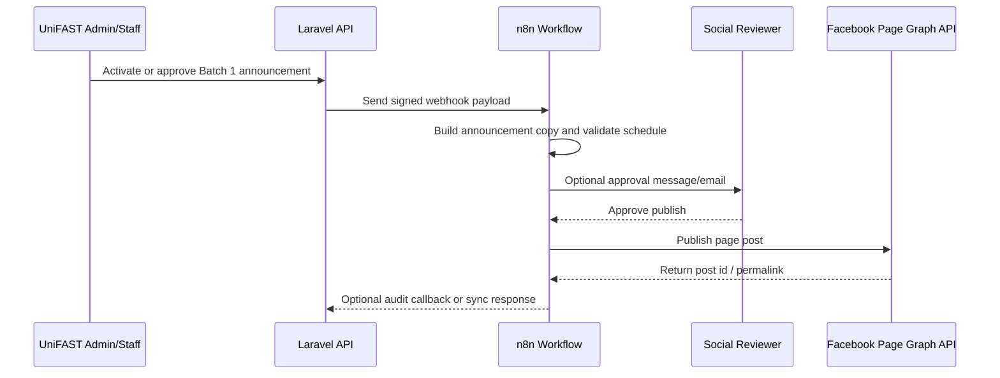

# n8n Facebook Batch Announcement Integration

> Purpose: use n8n as the automation layer for controlled Facebook posting when a TES batch is released, opened, or announced.
>
> Scope for Batch 1: publish an approved Facebook announcement, optionally notify internal reviewers, and keep Laravel as the source of batch/student truth.

---

## Current system context

The project is a Laravel 13 API/backend with a Vue 3 SPA frontend.

Relevant existing backend pieces:

| Area | File | Notes |
| --- | --- | --- |
| Batch windows | `backend/app/Http/Controllers/BatchController.php` | `activate`, `deactivate`, and `extendDeadline` change batch state and send student notifications/mail. |
| Batch activation emails | `backend/app/Http/Controllers/BatchActivationNotificationController.php` | Sends activation invite emails to unverified students in a batch. |
| n8n config | `backend/config/services.php` | Uses the `tcc_unifast_n8n` service config. |
| n8n sync proxy | `backend/app/Http/Controllers/TccUnifastSyncController.php` | Protected endpoint that accepts sync requests and forwards a payload to an n8n webhook. |
| n8n student export | `backend/app/Http/Controllers/TccUnifastStudentsController.php` | Protected endpoint that lets n8n page through student rows. |
| Submission pipeline n8n hook | `backend/app/Jobs/ProcessRequirementSubmissionPipeline.php` | Posts `requirement_submission_confirmed` events to the configured n8n webhook when enabled. |
| API routes | `backend/routes/api.php` | Existing external integration routes live at `/api/integrations/n8n/tcc-unifast/*`. |

Existing n8n-related API routes:

```http
POST /api/integrations/n8n/tcc-unifast/sync
GET  /api/integrations/n8n/tcc-unifast/students
```

Both routes require this inbound header from n8n or an approved integration client:

```http
X-TCC-UniFAST-Endpoint-Key: <TCC_UNIFAST_SYNC_ENDPOINT_SECRET>
```

Laravel outbound calls to n8n use:

```text
TCC_UNIFAST_N8N_WEBHOOK_URL=<n8n production webhook URL>
TCC_UNIFAST_N8N_WEBHOOK_HEADER=X-TCC-UniFAST-Key
TCC_UNIFAST_N8N_WEBHOOK_SECRET=<shared secret configured in n8n>
TCC_UNIFAST_N8N_TIMEOUT=15
```

> Do not hardcode Facebook page tokens or n8n secrets in Laravel, Vue, or this repository. Keep them in deployment environment variables or n8n credentials.

---

## Recommended architecture

Use n8n as the social-media owner. Laravel should provide official batch data and/or emit approved events; n8n should hold Facebook credentials, approval gates, retries, and posting history.



For the Batch 1 release, prefer **manual approval before posting** even if the workflow is automated. This avoids accidental public announcements with wrong dates, deadlines, links, or student instructions.

---

## Integration modes

### Mode A — fastest for Batch 1: n8n manual trigger + Laravel data lookup

Use this if Batch 1 needs to be announced soon and you do not need a new Laravel UI button yet.

1. In n8n, create a workflow with a **Manual Trigger** or **Webhook Trigger**.
2. Add an HTTP Request node to fetch batch/student data from Laravel as needed.
3. Use the existing student export endpoint if the workflow needs roster counts:

   ```http
   GET https://<app-domain>/api/integrations/n8n/tcc-unifast/students?limit=500
   X-TCC-UniFAST-Endpoint-Key: <TCC_UNIFAST_SYNC_ENDPOINT_SECRET>
   ```

4. Compose the Facebook post in n8n.
5. Send the post to an approval step.
6. After approval, publish through Facebook Graph API.

Best for: one-time launch posts, controlled announcements, quick production rollout.

### Mode B — Laravel event triggers n8n when a batch opens

Use this after Batch 1 if announcements should become part of the batch-opening workflow.

Current `BatchController::activate` sends Laravel notifications/mail but does **not** currently emit a social announcement event. A future backend enhancement can post this event to n8n after a batch becomes active:

```json
{
  "event": "batch_window_opened",
  "batch": {
    "id": 1,
    "name": "Batch 1",
    "academic_year": "2026-2027",
    "semester": "1st Semester",
    "submission_deadline": "2026-08-30T23:59:59+08:00",
    "grantees_count": 500
  },
  "announcement": {
    "channel": "facebook",
    "mode": "approval_required",
    "campaign": "batch_1_release"
  },
  "source": "laravel",
  "requested_at": "2026-08-11T10:00:00+08:00"
}
```

Best for: repeatable announcements whenever a batch opens.

### Mode C — n8n calls Laravel sync endpoint

Use the existing sync endpoint when an external operator or n8n workflow needs Laravel to forward a normalized sync request to the configured n8n webhook:

```http
POST https://<app-domain>/api/integrations/n8n/tcc-unifast/sync
Content-Type: application/json
X-TCC-UniFAST-Endpoint-Key: <TCC_UNIFAST_SYNC_ENDPOINT_SECRET>
```

```json
{
  "batch": "Batch 1",
  "force_full_sync": true,
  "reason": "Prepare Facebook Batch 1 release announcement"
}
```

Laravel will add:

```json
{
  "request_id": "uuid",
  "source": "laravel",
  "requested_at": "iso timestamp"
}
```

and forward the payload to `TCC_UNIFAST_N8N_WEBHOOK_URL` with `TCC_UNIFAST_N8N_WEBHOOK_HEADER` / `TCC_UNIFAST_N8N_WEBHOOK_SECRET`.

---

## One-time n8n import JSON

An importable n8n workflow is available at:

```text
docs/n8n-tcc-unifast-facebook-social-post-workflow.json
```

Import it in n8n through **Workflows → Import from File**, then configure these n8n environment variables or replace the expressions with your own credentials:

```text
TCC_UNIFAST_N8N_WEBHOOK_SECRET=<same value as Laravel TCC_UNIFAST_N8N_WEBHOOK_SECRET>
FACEBOOK_PAGE_ID=<official Facebook Page ID>
FACEBOOK_PAGE_ACCESS_TOKEN=<Facebook Page access token>
LARAVEL_API_URL=https://<backend-domain>
TCC_UNIFAST_SYNC_ENDPOINT_SECRET=<same value as Laravel TCC_UNIFAST_SYNC_ENDPOINT_SECRET>
```

After importing and activating the workflow, copy the production webhook URL into Laravel:

```text
TCC_UNIFAST_N8N_WEBHOOK_URL=https://<n8n-domain>/webhook/tcc-unifast/social-posts/facebook
TCC_UNIFAST_N8N_WEBHOOK_HEADER=X-TCC-UniFAST-Key
TCC_UNIFAST_N8N_WEBHOOK_SECRET=<same shared secret>
```

The workflow stops posts with `approval_mode: approval_required` before Facebook publishing. In the Social Posts module, review the saved copy and then click **Approve and publish**. Laravel changes that post to `pre_approved` and sends a new signed request to n8n; the first review execution is not resumed. Choose **Approved to publish** before the initial dispatch only when the copy is already approved and ready to post/schedule.

After Facebook accepts a post, the workflow calls:

```http
POST /api/integrations/n8n/social-media-posts/{post}/status
X-TCC-UniFAST-Endpoint-Key: <TCC_UNIFAST_SYNC_ENDPOINT_SECRET>
```

This callback updates Laravel with the real Facebook post ID, permalink, Page profile/cover, follower counts when available, publish status, and timestamp. The Social Posts page refreshes the integration summary every 30 seconds.

### Integration status meanings

The status endpoint reports evidence from the Laravel database; a configured webhook is not presented as a successful n8n or Facebook connection.

| State | Meaning | Next action |
| --- | --- | --- |
| `not_configured` | Laravel is missing the n8n webhook URL or secret. | Configure the Laravel environment and refresh config. |
| `ready_for_first_post` | n8n settings exist, but this Laravel database has no social posts. | Save the first draft. |
| `draft_saved` | A Laravel draft exists but has not been dispatched. | Click **Send to n8n**. |
| `awaiting_approval` | n8n accepted a `Review first` request and intentionally stopped before Facebook. | Review it, then click **Approve and publish**. |
| `awaiting_facebook_callback` | An approved request reached n8n, but Laravel has not received the final callback. | Inspect the latest n8n execution, especially the Facebook and callback nodes. |
| `failed` | The latest Laravel-to-n8n dispatch failed. | Read the recorded post error, fix the cause, and retry. |
| `connected` | Laravel has received real Facebook Page metadata or a published Facebook result. | No connection action is required. |

### Troubleshooting: no real Page appears

1. Check whether the Docker-backed Laravel database contains a post:

   ```bash
   docker exec tcc-unifast-backend php artisan tinker --execute="dump(App\\Models\\SocialMediaPost::query()->latest()->get(['id','status','approval_mode','n8n_status','external_post_id'])->toArray());"
   ```

2. If the result is `[]`, no post was saved in the same backend/database used by the UI. Save a draft in the Social Posts module first.
3. If the state is `draft_saved`, click **Send to n8n**.
4. If the state is `awaiting_approval`, click **Approve and publish**. The review branch does not call Facebook.
5. If the state is `awaiting_facebook_callback`, open the latest n8n execution and verify it reached:

   ```text
   Get Facebook Page
   Publish to Facebook Page
   Format Publish Result
   Update Laravel with Facebook Result
   ```

6. Inside Docker, callback URLs must use `http://backend:8080`, not `localhost`. The callback secret must match `TCC_UNIFAST_SYNC_ENDPOINT_SECRET` in Laravel and n8n.
7. The backend and frontend source are baked into Docker images in this project. Rebuild/recreate the affected service after source changes.

---

## n8n workflow design for Facebook Batch 1

Recommended workflow name:

```text
TCC UniFAST — Facebook Batch 1 Announcement
```

Recommended nodes:

1. **Trigger**
   - For immediate launch: `Manual Trigger` or `Webhook Trigger`.
   - For automated launch: Laravel webhook event from a future batch activation hook.
2. **Set: Campaign Defaults**
   - `campaign`: `batch_1_release`
   - `channel`: `facebook`
   - `approval_required`: `true`
   - `timezone`: `Asia/Manila`
3. **HTTP Request: Fetch Batch/Student Data**
   - Optional if all details are entered manually.
   - Use protected Laravel endpoints with `X-TCC-UniFAST-Endpoint-Key`.
4. **Function or Code: Compose Announcement**
   - Generate final text from fixed templates and batch variables.
   - Do not include private student data.
5. **IF: Validate Required Fields**
   - Must have batch name, deadline, portal URL, contact/helpdesk info, and final copy.
6. **Approval Step**
   - Send approval request to email, Slack, Discord, or another internal channel.
   - Include preview text and image.
7. **Facebook Graph API: Create Page Post**
   - Publish only after approval.
8. **Log Result**
   - Store `post_id`, permalink, publish time, approver, and campaign in n8n data store, Google Sheet, or future Laravel audit callback.
9. **Failure Notification**
   - Alert admins if Facebook API fails, token expires, or approval is rejected.

---

## Facebook Graph API setup

In Meta/Facebook:

1. Create or use an existing Meta app.
2. Connect the official Facebook Page.
3. Generate a Page Access Token with permissions appropriate to Page posting.
4. Store the token in n8n credentials, not in Laravel.
5. In n8n, use either:
   - the built-in Facebook Graph API node if available, or
   - an HTTP Request node.

Typical HTTP Request node for a text post:

```http
POST https://graph.facebook.com/v20.0/<PAGE_ID>/feed
Authorization: Bearer <PAGE_ACCESS_TOKEN>
Content-Type: application/json
```

Body:

```json
{
  "message": "<approved announcement copy>",
  "published": true
}
```

For scheduled posts, use Facebook-supported scheduling fields and ensure the schedule time meets Graph API requirements. Keep the workflow timezone set to `Asia/Manila`.

---

## Batch 1 announcement content template

Use a public-safe message. Do not expose the imported masterlist, student IDs, private student counts if not approved, emails, or internal review statuses.

Draft copy:

```text
📢 TCC UniFAST TES Batch 1 Announcement

Tagoloan Community College UniFAST TES Batch 1 is now open for student portal activation and requirement submission.

Eligible grantees listed in the official CHED/TES masterlist should check their registered email for portal activation instructions and complete the required verification steps within the submission window.

Portal: <FRONTEND_URL>
Submission deadline: <DEADLINE>

For questions or assistance, please contact the UniFAST/TES office through the official TCC support channels.

#TCCUniFAST #TES #TagoloanCommunityCollege
```

Optional shorter variant:

```text
📢 TCC UniFAST TES Batch 1 is now open.

CHED/TES-listed grantees may activate their student portal account and submit requirements through the official portal: <FRONTEND_URL>

Deadline: <DEADLINE>

Please check your registered email for instructions.
```

---

## Required environment variables

Configure these in the Laravel backend deployment environment:

```text
TCC_UNIFAST_N8N_WEBHOOK_URL=https://<n8n-domain>/webhook/<workflow-path>
TCC_UNIFAST_N8N_WEBHOOK_HEADER=X-TCC-UniFAST-Key
TCC_UNIFAST_N8N_WEBHOOK_SECRET=<shared outbound secret sent by Laravel to n8n>
TCC_UNIFAST_SYNC_ENDPOINT_SECRET=<shared inbound secret required by Laravel integration endpoints>
TCC_UNIFAST_N8N_TIMEOUT=15
TCC_UNIFAST_STUDENT_TABLE=grantees
FRONTEND_URL=https://<frontend-domain>
```

Notes:

- `TCC_UNIFAST_N8N_WEBHOOK_SECRET` protects Laravel → n8n calls.
- `TCC_UNIFAST_SYNC_ENDPOINT_SECRET` protects n8n/external → Laravel calls.
- `TCC_UNIFAST_STUDENT_TABLE` defaults to `students`, but this codebase uses grantee-centered tables. Verify the live database table before enabling student export.
- If config is cached in production, run Laravel config cache refresh after changing environment variables.

---

## Security and privacy checklist

Before enabling Facebook posting:

- [ ] Use only official TCC/UniFAST Facebook Page credentials.
- [ ] Store Facebook Page Access Token inside n8n credentials.
- [ ] Store Laravel/n8n shared secrets as environment variables.
- [ ] Require manual approval for public posts.
- [ ] Do not include names, student IDs, emails, document statuses, or KYC/eligibility details in public copy.
- [ ] Rate-limit public webhook triggers; existing Laravel routes already use throttling.
- [ ] Use HTTPS for Laravel and n8n endpoints.
- [ ] Rotate secrets if a workflow export is shared externally.
- [ ] Log the approver, final copy, publish timestamp, and Facebook post ID.

---

## Batch 1 launch runbook

1. Confirm Batch 1 details in Laravel:
   - batch name
   - academic year / semester
   - active window status
   - submission deadline
   - portal URL
   - support contact instructions
2. Confirm the Facebook Page and Meta app token work in n8n.
3. Create the n8n workflow using the node plan above.
4. Run a dry run with `published=false` or a test Facebook Page if available.
5. Send approval preview to the designated social/content reviewer.
6. Publish after approval.
7. Save the Facebook post ID/permalink.
8. Monitor comments/messages for student support needs.
9. If the submission deadline changes, publish a follow-up deadline update instead of editing history silently.

---

## Suggested future backend enhancement

For a more complete in-app integration, add a dedicated admin/staff endpoint such as:

```http
POST /api/batches/{batch}/social-announcements
```

Example request body:

```json
{
  "channel": "facebook",
  "campaign": "batch_1_release",
  "message": "Approved public announcement copy...",
  "mode": "approval_required",
  "scheduled_for": "2026-08-12T09:00:00+08:00"
}
```

The endpoint should:

1. require `developer`, `admin`, `head`, or `staff` role;
2. validate public-safe fields;
3. send a signed payload to n8n;
4. return `202 Accepted` with a `request_id`;
5. record an audit event once n8n confirms the publish result.

This keeps Facebook tokens out of Laravel while giving staff a controlled “request announcement” action from the UniFAST admin portal.
