# UniFAST TES Grantee Management System
## System Architecture & Data Flow Diagrams Documentation (Thesis Reference)

This document provides complete, thesis-grade architectural descriptions, process specifications, and data dictionaries for all diagrams developed for the **UniFAST Tertiary Education Subsidy (TES) Grantee Management System**.

---

# 📑 Table of Contents
1. [Context Diagram (DFD Level 0)](#1-context-diagram-dfd-level-0)
2. [Data Flow Diagram (DFD Level 1)](#2-data-flow-diagram-dfd-level-1)
3. [Data Flow Diagram (DFD Level 2) — Process 3.0](#3-data-flow-diagram-dfd-level-2--process-30)
4. [System Operational Flowchart](#4-system-operational-flowchart)
5. [Summary Cross-Reference Matrix](#5-summary-cross-reference-matrix)

---

# 1. Context Diagram (DFD Level 0)

### 1.1 Diagram Overview
The **Context Diagram (Level 0 DFD)** represents the entire UniFAST TES Grantee Management System as a single centralized software process (`Process 0.0`), establishing the boundary between the internal application and external human actors.

* **Primary Process:** `0.0 UniFAST TES Grantee Management System`
* **Artifact File:** [`context_diagram.html`](file:///c:/Users/BRANDON/Downloads/tcc-unifast/context_diagram.html)
* **Academic Purpose:** Defines the high-level operational scope, boundary conditions, and primary inputs/outputs of the system without exposing internal database structures or algorithms.

```
                  +----------------------------------------------------+
                  |                    External Entity:                |
                  |                         ADMIN                      |
                  +----------------------------------------------------+
                        │ ▲                                ▲ │
(Credentials, Masterlists,│ │(Audit Logs, Billing Reports,  │ │(System Policies,
 Batch & Program Config)│ │ Analytics, System Reports)    │ │ Mass Announcements)
                        ▼ │                                │ ▼
                  +────────────────────────────────────────────────────+
                  |                    PROCESS 0.0                     |
                  |     UniFAST TES Grantee Management System          |
                  +────────────────────────────────────────────────────+
                        ▲ │                                ▲ │
  (KYC Profile, ID Scan,│ │(Account Invites, Notices,      │ │(Biometric Review
 Password, Requirement │ │ In-App Alerts, Compliance Form)│ │ Decisions, Doc Approvals)
      Submissions)      │ ▼                                ▼ │
                  +-----------------------+      +-----------------------+
                  |    External Entity:   |      |    External Entity:   |
                  |        GRANTEE        |      |         STAFF         |
                  +-----------------------+      +-----------------------+
```

---

### 1.2 External Entities & Roles

| External Entity | Operational Role | Key Inbound Data (Inputs to System) | Key Outbound Data (Outputs from System) |
|---|---|---|---|
| **Admin** | System Head / Scholarship Administrator | • Admin Credentials & Session<br>• CHED Masterlist Spreadsheets (XLSX/CSV/PDF)<br>• Academic Batch & Program Parameters<br>• System Policies & Retention Rules<br>• Custom Survey/Form Definitions<br>• Mass Notifications & Announcements | • System Audit Trail Logs<br>• Official CHED Billing Masterlists<br>• Fund Distribution & Payroll Summaries<br>• Analytics Dashboard & KPI Metrics<br>• Import Validation & Error Reports |
| **Grantee** | TES Beneficiary / College Student | • Account Activation Tokens<br>• Baseline KYC & Demographic Information<br>• School ID Scans (Front & Back)<br>• Live Liveness Recording & Selfie Stills<br>• Chosen Account Password *(only after identity verification)*<br>• Academic Requirements (Course History, Grade Slip, ID Back-to-Back & Specimen)<br>• Periodic Survey Responses | • Account Activation Email Links<br>• Real-Time Verification Status Alerts<br>• Document Resubmission / Return Notes<br>• Formal Eligibility Outcome Notices<br>• Assigned Evaluation Forms |
| **Staff** | Scholarship Office Validator / Reviewer | • Staff Credentials & RBAC Session<br>• Manual Biometric Verification Decisions<br>• Document Review Outcomes (Approve/Return)<br>• Specific Document Rejection Remarks | • Grantee Master Directory & Profiles<br>• Flagged Biometric Inspection Photos<br>• Pending Document Submission Packages<br>• Automated Risk Score Breakdowns |

---

# 2. Data Flow Diagram (DFD Level 1)

### 2.1 Diagram Overview
The **DFD Level 1** decomposes `Process 0.0` into the **eight (8) core functional processes**, **eight (8) permanent data stores**, and their data pathways using Gane & Sarson notation.

* **Artifact Reference:** [`dfd_level1_diagram.html`](file:///c:/Users/BRANDON/Downloads/tcc-unifast/dfd_level1_diagram.html)
* **Draw.io Source:** [`dfd_level1_clean.drawio`](file:///c:/Users/BRANDON/Downloads/tcc-unifast/dfd_level1_clean.drawio)

---

### 2.2 Process Decompositions (1.0 to 8.0)

#### Process 1.0: User and Access Management
* **Responsibility:** Handles role-based authentication, user account provisioning, system security policies, and application FAQs.
* **Inputs:** Admin credentials, staff account assignments, policy updates (`Admin` $\rightarrow$ `1.0`).
* **Outputs:** Auth session tokens (`1.0` $\rightarrow$ `Admin`/`Staff`/`Grantee`), user access logs.
* **Data Stores:** `D1 User Account Records`, `D3 Batch and Program Records`.

#### Process 2.0: Grantee Masterlist and Batch Management
* **Responsibility:** Ingests external CHED masterlists, parses and detects tabular structures, executes row validations, manages academic batch cycles, and initiates account invitation dispatches.
* **Inputs:** Raw CHED masterlist files, batch configuration, submission deadlines (`Admin` $\rightarrow$ `2.0`).
* **Outputs:** Validation summary statistics, batch profiles.
* **Internal Triggers:** Sends `Grantee Account Activation Information` to `Process 3.0` and activation notices to `Process 7.0`.
* **Data Stores:** `D2 Grantee Records`, `D3 Batch and Program Records`.

#### Process 3.0: Grantee Onboarding and Identity Verification
* **Responsibility:** Validates one-time activation tokens and issues scoped onboarding sessions, cross-matches student KYC data against masterlist truth, performs dual-side School ID OCR, executes interactive liveness challenges (128-D Euclidean face matching), routes exceptions to staff review, and — **only after identity is verified** — creates the account credential.
* **Inputs:** Activation tokens, KYC forms, ID scans, liveness gestures, chosen password (`Grantee` $\rightarrow$ `3.0`); Biometric decisions (`Staff` $\rightarrow$ `3.0`).
* **Outputs:** Flagged identity review photos (`3.0` $\rightarrow$ `Staff`); Verification status (`3.0` $\rightarrow$ `7.0`); Verified grantee context (`3.0` $\rightarrow$ `4.0`).
* **Data Stores:** `D1 User Accounts`, `D2 Grantee Records`, `D4 Identity and Biometric Records`.

#### Process 4.0: Document Submission and Review
* **Responsibility:** Receives 3 mandatory document slots (Course History, Grade Slip, and ID Back-to-Back & 3 Specimen Signatures), runs OCR for unit/grade extraction, verifies the Document Vault PIN on confirmation when one is configured, and provides staff validation queues for approval/rejection. Access requires `account_status = active`, i.e. identity verified **and** credentialed.
* **Inputs:** Document uploads (`Grantee` $\rightarrow$ `4.0`); Validation decisions & return notes (`Staff` $\rightarrow$ `4.0`).
* **Outputs:** Package inspection views (`4.0` $\rightarrow$ `Staff`); Resubmission alerts (`4.0` $\rightarrow$ `7.0`).
* **Internal Trigger:** Emits `Reviewed Document Records` to `Process 5.0`.
* **Data Stores:** `D2 Grantee Records`, `D4 Identity Records`, `D6 Document Submission Records`.

#### Process 5.0: Eligibility Assessment
* **Responsibility:** Automated rules engine evaluating 3 compliance criteria: (1) Active Batch Enrollment, (2) Complete 3-slot Document Vault, and (3) Academic Retention (failed subjects $\le$ policy threshold). Calculates multi-factor risk scores and compliance badges.
* **Inputs:** Reviewed document package from `Process 4.0`, academic retention thresholds from `D3`.
* **Outputs:** Eligibility outcome views (`5.0` $\rightarrow$ `Staff`); Deficiency notices (`5.0` $\rightarrow$ `7.0`).
* **Internal Trigger:** Emits `Eligibility Assessment Results` to `Process 8.0`.
* **Data Stores:** `D2 Grantee Records`, `D5 Eligibility and Retention Records`.

#### Process 6.0: Form and Survey Management
* **Responsibility:** Custom form builder engine allowing administrators to create periodic surveys, deploy them to active grantee batches, enforce response deadlines, and analyze compliance.
* **Inputs:** Dynamic form schema definitions (`Admin` $\rightarrow$ `6.0`); Survey responses (`Grantee` $\rightarrow$ `6.0`).
* **Outputs:** Survey assignments (`6.0` $\rightarrow$ `Grantee`); Form response summaries (`6.0` $\rightarrow$ `Admin`).
* **Data Stores:** `D7 Form and Survey Records`.

#### Process 7.0: Notification Management
* **Responsibility:** Centralized communication hub managing real-time websocket alerts, in-app notification logs, and SMTP email dispatch for system events.
* **Inputs:** Triggers from `2.0` (invites), `3.0` (biometrics), `4.0` (returns), `5.0` (eligibility notices), `6.0` (survey assignments), and `Admin` (mass announcements).
* **Outputs:** In-app and email notifications (`7.0` $\rightarrow$ `Grantee`/`Staff`/`Admin`).
* **Data Stores:** `D1 User Accounts`, `D8 Audit and Report Records`.

#### Process 8.0: Reporting and Audit
* **Responsibility:** Generates official CHED TES Billing Masterlists, Grantee Fund Payrolls, Executive Analytics Dashboards, and immutable Audit Trail logs.
* **Inputs:** Report filter criteria (`Admin` $\rightarrow$ `8.0`); Eligibility results from `Process 5.0`.
* **Outputs:** Official CHED Billing Reports, Distribution Payrolls, Audit Log Exports (`8.0` $\rightarrow$ `Admin`).
* **Data Stores:** `D1`, `D2`, `D5`, `D8 Audit and Report Records`.

---

### 2.3 Data Stores Dictionary (D1 to D8)

| Store ID | Data Store Name | Primary Entities / Tables | Key Attributes Stored |
|---|---|---|---|
| **D1** | **User Account Records** | `users`, `personal_access_tokens` | `id`, `name`, `email`, `password_hash`, `role`, `account_status`, `activated_at` |
| **D2** | **Grantee Records** | `grantees`, `kyc_profiles` | `student_id`, `full_name`, `program`, `year_level`, `status`, `kyc_data` |
| **D3** | **Batch and Program Records** | `batches`, `academic_programs`, `policy_settings` | `academic_year`, `semester`, `submission_deadline`, `program_code`, `max_failed_subjects` |
| **D4** | **Identity and Biometric Records** | `grantee_identity_profiles`, `activation_tokens` | `id_reference_face_descriptor`, `ocr_payload`, `distance_score`, `liveness_status` |
| **D5** | **Eligibility and Retention Records** | `submission_pipeline_results` | `risk_score`, `risk_badge`, `passed_criteria_count`, `retention_status`, `evaluated_at` |
| **D6** | **Document Submission Records** | `document_submissions`, `file_manager` | `slot_key` (3 slots: `course_history`, `grade_slip`, `specimen_signatures`), `stored_path`, `ocr_extracted_units`, `ocr_gwa`, `status`, `review_notes` |
| **D7** | **Form and Survey Records** | `forms`, `form_fields`, `form_responses` | `form_title`, `schema_json`, `response_payload`, `submitted_at`, `status` |
| **D8** | **Audit and Report Records** | `audit_logs`, `batch_notifications` | `actor`, `role`, `action`, `module`, `target`, `context_json`, `ip_address`, `timestamp` |

---

# 3. Data Flow Diagram (DFD Level 2) — Process 3.0

### 3.1 Decomposition Rationale
**Process 3.0 (Grantee Onboarding & Identity Verification)** represents the core technical contribution of the system. It handles complex cryptographic token matching, automated Levenshtein string cross-matching, dual-sided ID optical character recognition, 128-dimensional facial descriptor math, and manual fallback review workflows.

* **Artifact Reference:** [`dfd_level2_diagram.html`](file:///c:/Users/BRANDON/Downloads/tcc-unifast/dfd_level2_diagram.html)
* **Balancing Scope:** 100% balanced with Level 1 interfaces (`2.0`, `4.0`, `7.0`, `Staff`, `Grantee`).

```
                                [Adjacent Process 2.0]
                                          │
                        (Grantee Account Activation Info)
                                          ▼
                                +───────────────────+
Grantee ──(Token only,────────► | 3.1 Validate Token| ◄───(Hashed Token)─── D4 Identity Records
          no password)          |  & Issue Scoped   | ────(Scoped Session)─► D1 User Accounts
                                |  Onboarding Sess. |
                                +───────────────────+
                                          │ (Onboarding Context)
                                          ▼
                                +───────────────────+
Grantee ──(KYC Information)───► | 3.2 Process &     | ◄───(Masterlist Truth)─ D2 Grantee Records
                                |  Cross-Match KYC  | ◄───(Programs)──────── D3 Programs
                                +───────────────────+
                                          │ (Validated KYC Status)
                                          ▼
                                +───────────────────+
Grantee ──(Dual School ID)────► | 3.3 Extract &     | ────(Face Crop & OCR)─► D4 Identity Records
                                |  Verify ID Data   |
                                +───────────────────+
                                          │ (ID Descriptors & OCR)
                                          ▼
                                +───────────────────+ ────(Auto-Pass)───────► [Adjacent Process 7.0]
Grantee ──(Liveness & Selfie)─► | 3.4 Evaluate Face | ────(Descriptors)─────► D4 Identity Records
                                |  Match & Liveness |
                                +───────────────────+
                                   │              │
                   (Flagged Match) │              │ (Auto-Pass Direct Bypass)
                                   ▼              │
                                +──────────────+  │
Staff ◄──(Photos for Review)─── | 3.5 Staff    |  │
Staff ───(Review Decision)────► |  Face Review |  │
                                +──────────────+  │
                                   │ (Approved)   │
                                   ▼              ▼
                                +───────────────────+
Grantee ──(Chosen Password)───► | 3.6 Create Account| ───(Password Hash)───► D1 User Accounts
                                |  Credentials      | ───(Token spent)─────► D4 Identity Records
                                |  (status must be  | ───(Status: active)──► D1 / D2
                                |  identity_verified)|
                                +───────────────────+
                                          │
                         (Verified Grantee Profile Info)
                                          ▼
                                [Adjacent Process 4.0]
```

> **Ordering note.** `3.6` deliberately follows `3.4`/`3.5`. Until it runs the account
> holds **no usable password**, so the biometric match in `3.4` is what establishes
> account ownership. See §3.4 for the rationale.

---

### 3.2 Level 2 Subprocesses (3.1 to 3.6)

| Subprocess # | Subprocess Name | Inbound Data (Inputs) | Outbound Data (Outputs) | Code Implementation |
|---|---|---|---|---|
| **3.1** | **Validate Token & Issue Scoped Onboarding Session** | • Activation Token (`Grantee`) — **no password**<br>• Activation Info (`Process 2.0`)<br>• Hashed Token (`D4`) | • Scoped session, abilities `onboarding:identity` (`D1`)<br>• Status `pending_kyc` (`D1`)<br>• Onboarding Context (`3.2`) | `ActivationController.php` (`begin`), `AuthTokenService.php` (`issueOnboardingSession`) |
| **3.2** | **Process & Cross-Match KYC Profile** | • KYC Details (`Grantee`)<br>• Masterlist Truth Data (`D2`)<br>• Academic Programs (`D3`) | • Stored KYC Data (`D2`)<br>• Status: `pending_identity` (`D1`)<br>• Validated Profile Context (`3.3`) | `StudentKycController.php` (`store`), `MasterlistTruthService.php` |
| **3.3** | **Extract & Verify School ID Data** | • ID Front & Back Scans (`Grantee`) | • Reference Face Crop & OCR Payload (`D4`)<br>• Face Descriptors Payload (`3.4`) | `IdentityOnboardingController.php` (`validateFrontIdOcr`, `storeIdScan`) |
| **3.4** | **Evaluate Biometric Liveness & Face Match** | • Liveness Stills & Selfie (`Grantee`)<br>• ID Reference Descriptor (`3.3`) | • Face Distance Metrics (`D4`)<br>• Auto-Pass Status (`Process 7.0`)<br>• Flagged Match Profile (`3.5`)<br>• Direct Bypass Context (`3.6`) | `IdentityOnboardingController.php` (`storeLiveness`), `FaceDescriptorMath.php` |
| **3.5** | **Conduct Staff Biometric Review** | • Pending Review Records (`D4`)<br>• Biometric Decision (`Staff`) | • Inspection Photos (`Staff`)<br>• Review Audit Log (`D5`)<br>• Decision Alert (`Process 7.0`)<br>• Staff Approval Context (`3.6`) | `FaceReviewController.php` (`approve`, `reject`), `AuditLog.php` |
| **3.6** | **Create Account Credentials** | • Chosen Password (`Grantee`)<br>• Biometric Confirmation (`3.4`/`3.5`) — status must be `identity_verified` | • Password Hash + `email_verified_at` (`D1`)<br>• Status: `active` / `verified` (`D1`/`D2`)<br>• Activation Token spent (`D4`)<br>• Full session replaces scoped session<br>• Verified Context (`Process 4.0`) | `OnboardingCredentialController.php` (`store`), `AuthTokenService.php` (`upgradeToFullSession`) |
| **3.7** | **Configure Document Vault Security PIN** *(opt-in)* | • 6-Digit PIN (`Grantee`) | • Bcrypt-hashed PIN (`D1.security_pin`) | `StudentSettingsController.php` (`updateSecurityPin`) |

> **PIN enforcement.** When a grantee has configured a PIN, `Process 4.0` will not
> accept a package confirmation without it: `ConfirmRequirementPackageService`
> verifies the submitted PIN with `Hash::check` before promoting any draft. Wrong
> attempts are rate-limited (5 per 15 minutes, per user) and written to `D8` as
> `vault_pin_rejected`, because a 6-digit PIN is only 10⁶ combinations and would
> otherwise be brute-forceable over the API. Grantees who never set a PIN are
> unaffected — the control is opt-in, layered on top of the mandatory
> `account_status = active` gate.

---

### 3.3 Dual Biometric Resolution Paths (revised)
1. **Automated Auto-Pass (Green Zone — Distance $< 0.45$):**
   * Instant cryptographic match. Bypasses staff intervention entirely (`3.4` $\rightarrow$ `3.6`), dispatches an automated pass alert to `7.0`, and immediately unlocks PIN setup.
2. **Staff Manual Review (Yellow/Red Zone — Distance $\ge 0.45$):**
   * Borderline or failed automated matches are placed in `pending_face_review` (`3.4` $\rightarrow$ `3.5`).
   * Staff validator inspects side-by-side photos and issues an official decision. Approval forwards the profile to `3.6` and emails a fresh set-password link; Rejection sets `identity_rejected` (recoverable) and emails a fresh link so the grantee can retake the ID scan.

---

### 3.4 Security Design Rationale: Identity Before Credential

The ordering of `3.1` → `3.4` → `3.6` is the central security property of this
subsystem, and it is a deliberate departure from the conventional pattern.

**Conventional pattern (rejected).** Most invitation flows set the password at link
click, then verify identity afterwards. Applied here, that would mean **possession of
a forwarded email is sufficient to permanently own a grantee's account**. The
128-dimensional face match in `3.4` would then run *after* ownership was already
settled, reducing it to a gate on document upload rather than on the account itself.
Two consequences follow: an impostor who reaches `3.5` and is rejected would have the
**legitimate** student's account marked as failed; and the public token-validation
endpoint would be disclosing `student_id`, `full_name`, and `program` to any link
holder before authentication.

**Implemented pattern.** The activation token grants only a short-lived, ability-scoped
session (`onboarding:identity`, 30 minutes) that can reach the identity funnel and
nothing else. `users.password` holds an unusable random hash until `3.6`. Therefore:

| Property | Mechanism |
|---|---|
| Ownership is bound to biometrics, not to email possession | `3.6` requires `account_status = identity_verified` |
| A leaked link cannot yield a credential | Scoped session carries no password-setting ability |
| Scope cannot be escalated by token refresh | Onboarding sessions are issued with **no** refresh token, so there is nothing to rotate |
| A rejected impostor cannot lock out the real grantee | `3.5` rejection sets `identity_rejected` (recoverable) and re-issues a link to the address of record |
| The public endpoint discloses no PII | `3.1` returns only a masked email and an expiry |

**Accepted trade-off.** Because the credential is created last, the activation token
must remain valid across the whole funnel rather than being consumed on first click.
This is mitigated by a shortened 24-hour TTL, one live session per token,
rate-limited self-service resend, and event-driven re-issue on every staff decision —
so link expiry is never a dead end.

**Verification.** `tests/Feature/IdentityFirstJourneyTest.php` walks a single student
from emailed link to submitted vault package, asserting after each step that the
password hash is unchanged; `tests/Feature/OnboardingSessionScopeTest.php` and
`IdentityFirstActivationTest.php` cover scope confinement and non-disclosure.

**Staff exception.** Staff, admin, and developer accounts do not pass through the
biometric funnel — there is no identity check to wait for — so they set a password
directly from their invite link (`StaffActivationController`). Ownership there rests
on an administrator having authorised the invite. The endpoint asserts the account
role, so a student token cannot be redirected to it to bypass `3.4`.

---

# 4. System Operational Flowchart

### 4.1 Flowchart Standard Shapes Reference (ANSI / ISO Standards)

```
  ([ Terminator ])       [/ Input / Output /]       [ Process Block ]        { Decision Block }       [( Database Store )]
  (Start / End Points)    (User Uploads/Forms/PDF)   (Calculations/OCR/Auth)  (Condition / Branching)  (Permanent Log/DB)
```

---

### 4.2 End-to-End Operational Lifecycle

```mermaid
flowchart TD
    %% ── STYLES ──
    classDef startEnd fill:#f8fafc,stroke:#334155,stroke-width:2px,font-weight:bold;
    classDef adminBlock fill:#dbeafe,stroke:#1e40af,stroke-width:1.5px;
    classDef studentBlock fill:#fef3c7,stroke:#b45309,stroke-width:1.5px;
    classDef staffBlock fill:#e0e7ff,stroke:#4338ca,stroke-width:1.5px;
    classDef sysBlock fill:#f1f5f9,stroke:#475569,stroke-width:1.5px;
    classDef decisionBlock fill:#fef9c3,stroke:#854d0e,stroke-width:1.5px;
    classDef dbBlock fill:#ecfdf5,stroke:#047857,stroke-width:1.5px;

    %% ── PHASE 1: ADMIN SETUP & INTAKE ──
    Start([● START: Academic Period Begins]):::startEnd --> A1[/Admin Creates Batch & Sets Submission Window/]:::adminBlock
    A1 --> A2[/Admin Uploads CHED Masterlist Excel/CSV/PDF/]:::adminBlock
    A2 --> A3[System Parses & Validates Student Rows]:::sysBlock
    A3 --> D1{Are Data Rows Valid?}:::decisionBlock
    D1 -- No: Errors Detected --> A2
    D1 -- Yes: Valid --> A4[Admin Commits Import & Triggers Batch Activation]:::adminBlock
    A4 --> A5[/System Dispatches Activation Email with One-Time Token/]:::sysBlock

    %% ── PHASE 2: GRANTEE ACCOUNT ACTIVATION & KYC ──
    A5 --> S1[/Grantee Receives Email & Clicks Activation Link/]:::studentBlock
    S1 --> S2[System Issues Scoped Onboarding Session<br>NO password set yet]:::sysBlock
    S2 --> S3[/Grantee Completes Personal & Academic KYC Profile/]:::studentBlock
    S3 --> S4[System Saves KYC Profile -> Status: pending_identity]:::sysBlock

    %% ── PHASE 3: BIOMETRIC IDENTITY & LIVENESS ──
    S4 --> S5[/Grantee Scans School ID Front & Back/]:::studentBlock
    S5 --> S6[System Runs OCR: Matches Name & Student ID vs Masterlist]:::sysBlock
    S6 --> D2{ID OCR & Face Quality >= 0.50?}:::decisionBlock
    D2 -- No: OCR/Quality Fail --> S5
    D2 -- Yes: ID Stored --> S7[/Grantee Performs Interactive Liveness Challenge/]:::studentBlock
    S7 --> S8[System Computes Euclidean Face Descriptor Distance]:::sysBlock
    S8 --> D3{Face Match Classification}:::decisionBlock
    
    D3 -- Yellow/Red Zone: Low Score --> ST1[Queue in Staff Biometric Review Queue]:::staffBlock
    ST1 --> D4{Staff Manual Review Decision}:::decisionBlock
    D4 -- Rejected: fresh link emailed<br>status identity_rejected --> S5
    D4 -- Approved: set-password link emailed --> S8B

    D3 -- Green Zone: High Match --> S8B[Status: identity_verified<br>Identity proven, still NO password]:::sysBlock

    %% ── PHASE 3B: CREDENTIAL CREATION (AFTER VERIFICATION) ──
    S8B --> S8C[/Grantee Chooses Their Password/]:::studentBlock
    S8C --> S9[System Sets Credential -> Status: active<br>Scoped session upgraded to full session]:::sysBlock

    %% ── PHASE 4: DOCUMENT SUBMISSION VAULT ──
    S9 --> S11[/Grantee Uploads 3 Required Documents:<br>1. Course History<br>2. Official Grade Slip<br>3. ID Back-to-Back &amp; 3 Specimen Signatures/]:::studentBlock
    S11 --> S12[System Runs Document OCR & Previews Extracted Data]:::sysBlock
    S12 --> S13[/Grantee Confirms Submission Package -> Status: docs_submitted/]:::studentBlock

    %% ── PHASE 5: STAFF DOCUMENT VALIDATION ──
    S13 --> ST2[Staff Inspects Document Package in Validation Queue]:::staffBlock
    ST2 --> D5{Staff Document Review Decision}:::decisionBlock
    
    D5 -- Resubmission Requested --> N1[/System Sends Return Notification with Staff Notes/]:::sysBlock
    N1 --> S14[/Grantee Re-uploads Rejected Document Slot Only/]:::studentBlock
    S14 --> ST2

    D5 -- Approved --> E1[System Pipeline Triggers Automated Eligibility Assessment]:::sysBlock

    %% ── PHASE 6: ELIGIBILITY ASSESSMENT & RISK SCORING ──
    E1 --> E2[System Evaluates Retention Rules:<br>1. Active Batch Enrollment<br>2. Complete 3-slot Document Vault<br>3. Failed Subjects <= Threshold]:::sysBlock
    E2 --> E3[System Computes Risk Score & Compliance Badge]:::sysBlock
    E3 --> D6{Eligibility Outcome}:::decisionBlock

    D6 -- Needs Update / Deficient --> N2[/System Sends Eligibility Deficiency Notice/]:::sysBlock
    N2 --> S14

    D6 -- Eligible --> E4[Grantee Status Set to: ELIGIBLE]:::sysBlock

    %% ── PHASE 7: SEQUENTIAL BILLING & AUDIT (CLEAN LINEAR FLOW) ──
    E4 --> N3[/System Sends Formal Grantee Eligibility Notice/]:::sysBlock
    N3 --> A6[/Admin Generates CHED TES Billing Masterlist/]:::adminBlock
    A6 --> A7[/Admin Generates Grantee Fund Distribution & Payroll Report/]:::adminBlock
    A7 --> A8[(System Writes All Actions to Immutable Audit Logs)]:::dbBlock
    A8 --> EndNode([● END: TES Grant Disbursed & Audited]):::startEnd
```

> <sub>**Revised (identity-first activation):** `S2` read "Grantee Sets Password & Activates Account". Password creation moved to **Phase 3B** (`S8C`), after the biometric paths converge, so the face match gates account ownership rather than document upload. The former `S10` PIN-unlock step was removed — the vault PIN is now an opt-in setting verified at confirm. `S11`/`E2` corrected from 4 slots to 3.</sub>



---

# 5. Summary Cross-Reference Matrix

| Diagram Type | Figure Number in Thesis | Primary Focus | Target Chapter | Source Artifact |
|---|---|---|---|---|
| **Context Diagram (Level 0)** | Figure 4.1 | System boundary, External Entities, Global Inputs/Outputs | Chapter 4: System Architecture | [`context_diagram.html`](file:///c:/Users/BRANDON/Downloads/tcc-unifast/context_diagram.html) |
| **DFD Level 1** | Figure 4.2 | 8 Major Functional Modules, Data Stores (D1–D8), Inter-process Flows | Chapter 4: Detailed Design | [`dfd_level1_diagram.html`](file:///c:/Users/BRANDON/Downloads/tcc-unifast/dfd_level1_diagram.html) |
| **DFD Level 2 (Process 3.0)** | Figure 4.3 | Decomposition of Identity & Biometric Verification (`3.1` to `3.6`) | Chapter 4: Security & Verification Engine | [`dfd_level2_diagram.html`](file:///c:/Users/BRANDON/Downloads/tcc-unifast/dfd_level2_diagram.html) |
| **System Flowchart** | Figure 3.2 | Step-by-step user decision trees and automated background logic | Chapter 3: Research Methodology | [`system_diagrams_documentation.md`](file:///c:/Users/BRANDON/Downloads/tcc-unifast/system_diagrams_documentation.md) |
| **Security Design Rationale** | §3.4 (narrative) | Why the credential is created after biometric verification | Chapter 4: Security & Verification Engine | This document |
| **Use Case Diagram** | Figure 3.1 | Functional actors (Admin, Grantee, Staff) and use cases | Chapter 3: Requirements Analysis | Draw.io Diagram |
